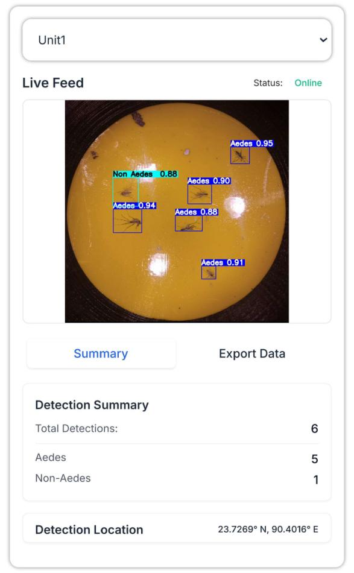

# MAST-CloudNet

An edge-to-cloud pipeline for live Aedes surveillance, using a Raspberry Pi for streaming and a cloud server for YOLOv11 inference.

<div align="center">
  
</div>

## Overview

MAST-CloudNet is a distributed system designed for real-time mosquito surveillance, specifically targeting Aedes species. The project implements an edge-to-cloud architecture that combines:

- **Edge Computing**: Raspberry Pi devices for local data capture and streaming
- **Cloud Processing**: Server-side YOLOv11 model inference for mosquito detection and identification
- **Real-time Pipeline**: Live streaming capabilities for continuous surveillance

## Architecture

The system follows a two-tier architecture:

### Edge Layer (Raspberry Pi)
- Captures video/image data from surveillance cameras
- Handles local preprocessing and streaming
- Maintains low-latency data transmission to cloud servers

### Cloud Layer (Server)
- Receives streaming data from edge devices
- Performs YOLOv11-based object detection and classification
- Processes mosquito identification and surveillance analytics

## Key Features

- **Real-time Surveillance**: Live monitoring of Aedes mosquito populations
- **Edge-to-Cloud Processing**: Distributed computing for optimal performance
- **YOLOv11 Integration**: State-of-the-art object detection for accurate mosquito identification
- **Scalable Architecture**: Support for multiple Raspberry Pi edge nodes
- **Live Streaming**: Real-time data transmission and processing
- **Web Dashboard**: User-friendly interface for monitoring and data export
- **Detection Logging**: Comprehensive logging and CSV export functionality

## Prerequisites

### Server Requirements
- Ubuntu/Debian Linux server (recommended)
- Minimum 4 Cpu Cores
- Python 3.8 or higher
- GPU support recommended for YOLOv11 inference
- Minimum 4GB RAM, 8GB+ recommended
- Network connectivity for streaming

### Edge Requirements
- Raspberry Pi (Model 3B+, 4, 5, or Zero 2 W recommended).
- Compatible camera module
- Stable network connection
- MicroSD card (32GB+ recommended)

## Server Setup

### 1. System Dependencies

```bash
# Update system packages
sudo apt update && sudo apt upgrade -y

# Install Python 3 and pip
sudo apt install python3 python3-pip python3-venv -y

# Install system dependencies for OpenCV
sudo apt install libgl1-mesa-glx libglib2.0-0 libsm6 libxext6 libxrender-dev libgomp1 -y
```

### 2. Clone Repository

```bash
# Clone the repository
git clone https://github.com/MAST-CloudNet-Code/MAST-CloudNet.git
cd MAST-CloudNet
```

### 3. Python Environment Setup

```bash
# Create virtual environment
python3 -m venv venv

# Activate virtual environment
source venv/bin/activate

# Install required Python packages
pip install flask opencv-python ultralytics waitress numpy
```

### 4. Model Preparation

```bash
# Create models directory
mkdir -p models

# Place your trained YOLO model file (best.pt) in the models directory
# The application expects the model at: models/best.pt
```

### 5. Configure Firewall

```bash
# Allow port 5000 through firewall (adjust port as needed)
sudo ufw allow 5000/tcp
```

### 6. Run the Server

#### Development Mode
```bash
# Basic run with default settings (port 5000, 1 worker)
python app.py
```

#### Production Mode
```bash
# Run with custom configuration
python app.py --port 8080 --workers 4

# Available options:
# --port: Port to run the web server on (default: 5000)
# --workers: Number of worker threads to process frames (default: 1)
```

### 7. Verify Installation

Once the server starts successfully, you should see:
```
INFO - Successfully loaded YOLO model
INFO - Starting web server on port 5000 with 1 worker threads
INFO - Using Waitress production server
```

Access the web interface at: `http://your-server-ip:5000`

## Production Deployment

### Using systemd Service

1. Create service file:
```bash
sudo nano /etc/systemd/system/mast-cloudnet.service
```

2. Add service configuration:
```ini
[Unit]
Description=MAST CloudNet Mosquito Detection Server
After=network.target

[Service]
Type=simple
User=your-username
WorkingDirectory=/path/to/MAST-CloudNet
Environment=PATH=/path/to/MAST-CloudNet/venv/bin
ExecStart=/path/to/MAST-CloudNet/venv/bin/python app.py --port 5000 --workers 4
Restart=always
RestartSec=10

[Install]
WantedBy=multi-user.target
```

3. Enable and start:
```bash
sudo systemctl enable mast-cloudnet.service
sudo systemctl start mast-cloudnet.service
sudo systemctl status mast-cloudnet.service
```

## Web Interface Features

The web dashboard provides:

- **Live Video Stream**: Real-time detection feed with bounding boxes
- **Detection Counts**: Real-time counting of Aedes and Non-Aedes mosquitoes
- **System Status**: Camera status and uptime monitoring
- **Location Display**: GPS coordinates and map integration
- **Data Export**: CSV export of detection logs
- **Reset Functionality**: Counter reset capabilities

## API Endpoints

- `GET /`: Main dashboard interface
- `GET /frame`: Current frame with detections (JSON)
- `GET /count`: Current detection counts (JSON)
- `GET /stats`: System statistics (JSON)
- `GET /status`: System status (JSON)
- `POST /reset_count`: Reset detection counters
- `GET /export_counts`: Export detection data as CSV


## Setup Raspberry Pi Streaming Client (Edge Layer)

A robust, multi-threaded Python script designed to stream video from a Raspberry Pi (or any other machine with a camera) to a central server over the network. This client is optimized for long-running, unattended operation, making it ideal for MAST-CloudNet's *Aedes* surveillance.

### Installation (Raspberry Pi)

1.  **Access your Raspberry Pi's Terminal**


2.  **Enable the Camera (if using a Pi Camera Module)**
    ```bash
    sudo raspi-config
    ```
    Navigate to `Interface Options` -> `Legacy Camera` -> `Yes`, then save and reboot.


3.  **Clone the Repository & setup a Python virtual environment**
    Follow the instructions from the [server section of this guide](#clone-repository) 


5.  **Install Dependencies**
    Create a `requirements.txt` file with the following content:
    ```
    opencv-python-headless
    requests
    ```
    Then, install the requirements:
    ```bash
    pip install -r requirements.txt
    ```

---

## Run the script

The script is configured via command-line arguments.

| Argument          | Description                                                    | Default                  |
| ----------------- | -------------------------------------------------------------- | ------------------------ |
| `--camera`        | Camera index (`0`, `1`...)                                     | `0`                      |
| `--image`         | Path to a static image file for testing the script             | `None`                   |
| `--server`        | Full URL of the server's receiving endpoint.                   | `http://localhost:5000`  |
| `--fps`           | The maximum frames per second to capture.                      | `15`                     |
| `--retry`         | Seconds to wait between connection retry attempts.             | `5`                      |
| `--no-verify-ssl` | Disable SSL certificate verification for HTTPS connections.    | `False`                  |


Make sure your virtual environment is active (`source venv/bin/activate`).
```bash
# Stream from the default Pi Camera to a server at 192.168.1.100
python edge_stream.py --camera 0 --server [http://192.168.1.100:5000](http://192.168.1.100:5000) --fps 20
```

## Run as a Systemd Service (Recommended)
To ensure the client runs automatically on boot and restarts if it fails, [set it up as a systemd service](#using-systemd-service).


## Troubleshooting

### Common Issues

1. **Model not found**: Ensure `best.pt` is placed in the `models/` directory
2. **OpenCV issues**: Install system dependencies as shown in setup
3. **Port access**: Check firewall settings and port availability
4. **Camera connection**: Verify camera hardware and drivers

### Logs

- Application logs: `server.log`
- Experiment logs: `experiment_log.txt`
- System logs: `journalctl -u mast-cloudnet.service -f`

## Contact

For questions or collaboration opportunities, please reach out through GitHub issues or contact the https://du-eee-micronanolab.com/

---
