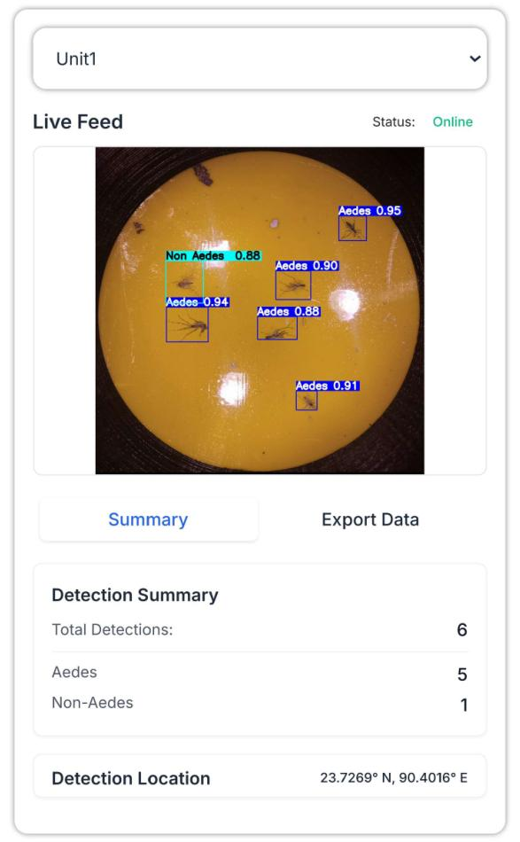

# MAST-CloudNet

**MAST-CloudNet** is a distributed edge-to-cloud pipeline designed for real-time *Aedes* mosquito surveillance. It utilizes a Raspberry Pi (Edge) for intelligent video streaming and a centralized Debian server (Cloud) for YOLOv11-based inference, tracking, and analytics.

<div align="center">
  
</div>
## Key Features

* **Real-time Inference**: YOLOv11 integration for high-accuracy detection of *Aedes* vs. *Non-Aedes* mosquitoes.
* **Robust Object Tracking**: Implements ByteTrack for consistent ID assignment and counting.
* **Edge-Optimized Streaming**: Custom threaded client (`edge_stream.py`) with LIFO queuing and latency tracking to ensure fresh frames over unstable networks.
* **Performance Analytics**: Detailed logging of network latency, queue wait times, and inference speeds.
* **Data Management**: One-click export for detection counts (CSV) and full system logs (ZIP).
* **Production Ready**: Designed for deployment with Gunicorn and Nginx.

---

## System Architecture

1.  **Edge Layer (Raspberry Pi)**:
    * Captures video via OpenCV or PiCamera2.
    * Tags frames with precise edge timestamps.
    * Streams frames to the cloud server via HTTP POST.
2.  **Cloud Layer (Debian Server)**:
    * Receives frames and calculates network latency.
    * Processes frames using YOLOv11.
    * Updates the live dashboard and maintains track histories.
    * Logs performance metrics asynchronously to avoid blocking inference.

---

## 1. Server Setup (Cloud/Central Node)

### Prerequisites
* **OS**: Debian 11/12/13 or Ubuntu 20.04/22.04 LTS.
* **Hardware**: Minimum 8 CPU Cores, 8GB RAM (GPU recommended for higher FPS).
* **Network**: Public Static IP of the server and high speed WiFi accessible by the Edge device.

### Installation

1.  **Update System & Install Dependencies**
    ```bash
    sudo apt update && sudo apt upgrade -y
    sudo apt install python3 python3-pip python3-venv libgl1-mesa-glx libglib2.0-0 -y
    ```

2.  **Clone Repository**
    ```bash
    git clone [https://github.com/MAST-CloudNet-Code/MAST-CloudNet.git](https://github.com/MAST-CloudNet-Code/MAST-CloudNet.git)
    cd MAST-CloudNet
    ```

3.  **Environment Setup**
    ```bash
    python3 -m venv venv
    source venv/bin/activate
    
    # Install core dependencies
    pip install flask opencv-python ultralytics numpy waitress gunicorn
    ```

4.  **Model Setup**
    Place your trained YOLO model (`best.pt`) in the `models/` directory:
    ```bash
    mkdir -p models
    # Ensure models/best.pt exists
    ```

### Running Locally (Development)
You can run the server directly using the built-in Waitress server:
```bash
python app.py --port 5000

```

Access the dashboard at `http://<server-ip>:5000`.

---

## 2. Production Deployment Guide (Gunicorn + Nginx)

For a robust, persistent deployment on a Debian server, we use **Gunicorn** as the WSGI application server and **Nginx** as the reverse proxy.

### Step 1: Configure Gunicorn Systemd Service

Create a system service to keep the application running in the background and restart it on failure.

1. Create the service file:
```bash
sudo nano /etc/systemd/system/mast-cloudnet.service

```


2. Paste the following configuration (adjust paths and username accordingly):
```ini
[Unit]
Description=MAST-CloudNet Gunicorn Instance
After=network.target

[Service]
User=your_username
Group=www-data
WorkingDirectory=/home/your_username/MAST-CloudNet
Environment="PATH=/home/your_username/MAST-CloudNet/venv/bin"
# Run Gunicorn with 4 workers, binding to a local unix socket for speed
ExecStart=/home/your_username/MAST-CloudNet/venv/bin/gunicorn --workers 4 --bind unix:mast-cloudnet.sock -m 007 app:app
Restart=always

[Install]
WantedBy=multi-user.target

```


3. Start and enable the service:
```bash
sudo systemctl start mast-cloudnet
sudo systemctl enable mast-cloudnet
sudo systemctl status mast-cloudnet

```


### Step 2: Configure Nginx Reverse Proxy

Nginx will handle incoming HTTP requests and forward them to Gunicorn.

1. Install Nginx:
```bash
sudo apt install nginx -y

```


2. Create a new server block config:
```bash
sudo nano /etc/nginx/sites-available/mast-cloudnet

```


3. Add the following configuration. **Note the `client_max_body_size` directive**, which is critical for allowing image uploads from the edge device.
```nginx
server {
    listen 80;
    server_name your_server_ip_or_domain;

    location / {
        include proxy_params;
        proxy_pass http://unix:/home/your_username/MAST-CloudNet/mast-cloudnet.sock;
    }

    # Crucial for receiving image frames via POST
    client_max_body_size 10M;
}

```


4. Enable the site and restart Nginx:
```bash
sudo ln -s /etc/nginx/sites-available/mast-cloudnet /etc/nginx/sites-enabled
sudo nginx -t  # Test configuration for errors
sudo systemctl restart nginx

```


### Step 3: Firewall

Ensure traffic is allowed on Port 80 (HTTP):

```bash
sudo ufw allow 'Nginx Full'

```

Your server is now live at `http://your_server_ip`.

---

## 3. Edge Setup (Raspberry Pi Client)

The `edge_stream.py` script captures video and streams it to the server. It is resilient to network drops and manages frame buffering.

### Installation

1. Clone this repo on the Raspberry Pi.
2. Install dependencies:
```bash
pip install opencv-python-headless requests numpy

```


### Usage

Run the streamer, pointing it to your deployed server's `/receive_frame` endpoint.

**If using Nginx (Port 80):**

```bash
python edge_stream.py --camera 0 --server http://<server-ip> --fps 5

```

**If using Dev Server (Port 5000):**

```bash
python edge_stream.py --camera 0 --server http://<server-ip>:5000 --fps 5

```

**Command Line Arguments:**
| Argument | Default | Description |
| :--- | :--- | :--- |
| `--camera` | `0` | Camera index (or `/dev/video0`) |
| `--server` | `localhost:5000` | Base URL of the cloud server |
| `--fps` | `5.0` | Target capture framerate |
| `--picam` | `False` | Use `libcamera` (PiCamera2) instead of OpenCV |
| `--image` | `None` | Path to a static image (for debugging) |

---

## API Documentation

The server exposes the following endpoints:

* **`GET /`**: Renders the main dashboard.
* **`POST /receive_frame`**: Accepts raw image bytes. Requires headers `X-Timestamp` and `X-Frame-ID`. Returns calculated network latency.
* **`GET /frame`**: Returns the latest processed frame (JPEG).
* **`GET /stats`**: Returns JSON object containing FPS, latency metrics, and detection counts.
* **`POST /reset`**: Resets tracking IDs, counters, and logs.
* **`GET /export_counts`**: Downloads a CSV of current detection counts.
* **`GET /export_logs`**: Downloads a ZIP file containing `server_performance_log.csv` and `experiment_log.txt`.

---

## Troubleshooting

1. **"413 Request Entity Too Large"**:
* This means Nginx is blocking the image upload. Ensure `client_max_body_size 10M;` is set in your Nginx config.


2. **Stream Lag**:
* Reduce the `--fps` on the edge device.
* Ensure the server has enough workers.


3. **Logs**:
* Check Gunicorn logs: `journalctl -u mast-cloudnet -f`
* Check Nginx error logs: `sudo tail -f /var/log/nginx/error.log`


## Contact

For questions or collaboration opportunities, please reach out through GitHub issues or contact the https://du-eee-micronanolab.com/

